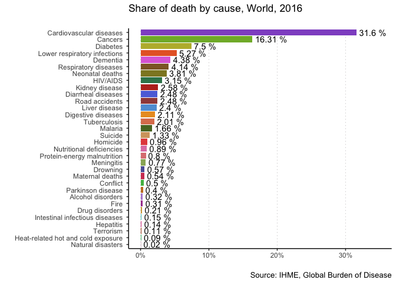
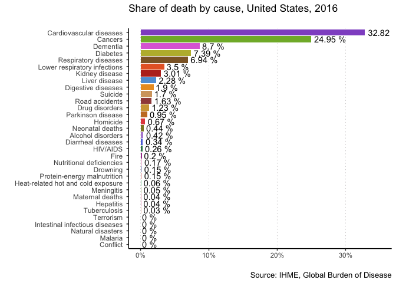
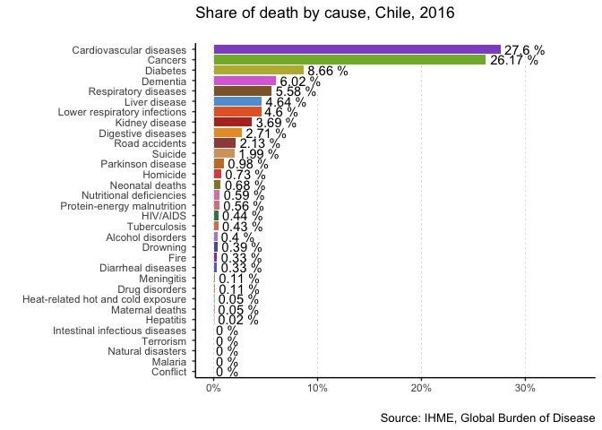

Tidy Tuesday Week 3
================
Felipe Flores

First of all, let's import the necessary packages:

``` r
library(tidyverse)
```

    ## ── Attaching packages ───────────────────────────────────────────────────────────────────────────────── tidyverse 1.2.1 ──

    ## ✔ ggplot2 2.2.1     ✔ purrr   0.2.4
    ## ✔ tibble  1.4.2     ✔ dplyr   0.7.4
    ## ✔ tidyr   0.8.0     ✔ stringr 1.3.0
    ## ✔ readr   1.1.1     ✔ forcats 0.3.0

    ## ── Conflicts ──────────────────────────────────────────────────────────────────────────────────── tidyverse_conflicts() ──
    ## ✖ dplyr::filter() masks stats::filter()
    ## ✖ dplyr::lag()    masks stats::lag()

``` r
library(rjson)
colors <- rjson::fromJSON(file = "colors.json")
```

`Rjson` is only needed for my color palette, which I created as a JSON from [here](http://tools.medialab.sciences-po.fr/iwanthue/). I also imported my color palette as the vector named `colors`. Next, since I want to be able to produce as many as these plots as I want, I created a function that would let me avoid redundance. The function first checks whether we're computing for the entire world or just a country, then does the necessary tidying up and plotting. Of course, in order to create the function I first explored the dataset. This is just the finalized product.

``` r
plotting_function <- 
  function(
    data,
    yearOfInterest,
    countryName,
    title = paste("Share of death by cause, ", countryName, ", ", yearOfInterest, sep = ""),
    subtitle = "",
    caption = "Source: IHME, Global Burden of Disease"
  ){
    if (countryName == "World") {
      data <- data %>% 
        filter(year == yearOfInterest) %>% 
        select(-c(country, country_code, year)) %>% 
        summarize_all(funs("sum"))
    } else {
      data <- data %>%
        filter(year == yearOfInterest, country == countryName) %>%
        select(-c(country, country_code, year))
    }
    data %>% 
      gather(key = "disease", value = "deaths") %>% 
      mutate(deaths = deaths / sum(deaths)) %>% 
      ggplot(aes(x = reorder(disease, deaths), y = deaths, fill = disease))+
      geom_bar(stat = "identity")+
      geom_text(aes(label = paste(round(100 * deaths, 2), "%")), hjust = -0.1)+
      scale_y_continuous(labels = scales::percent, limits = c(0, 0.35))+
      scale_fill_manual(values = colors)+
      guides(fill = FALSE)+
      coord_flip()+
      xlab("")+
      ylab("")+
      theme_classic()+
      labs(title = title, subtitle = subtitle, caption = caption)+
      theme(
        panel.grid.major.x = element_line(linetype = "dotted", color = "#5043484A")
      )
  }
```

So let's try it out on the dataset! First we import the data with `readxl` and use `stringr` to remove the percentage signs from the variable names. I also decided to omit `NA`'s, which I think is why my numbers are slightly different from those in the article. Oh well *shrug*

``` r
data <- readxl::read_xlsx("global_mortality.xlsx") %>% 
  rename_all(funs(stringr::str_remove_all(., "[(%)]"))) %>% 
  na.omit() 
```

Finally, let's use the function on the world, the US, and my beloved Chile for 2016.

``` r
plotting_function(data = data, yearOfInterest = 2016, countryName = "World")
```



``` r
plotting_function(data = data, yearOfInterest = 2016, countryName = "United States")
```



``` r
plotting_function(data = data, yearOfInterest = 2016, countryName = "Chile")
```



Nice! Of course, we could input any country and year and get the same kind of plot. That's all friends!
