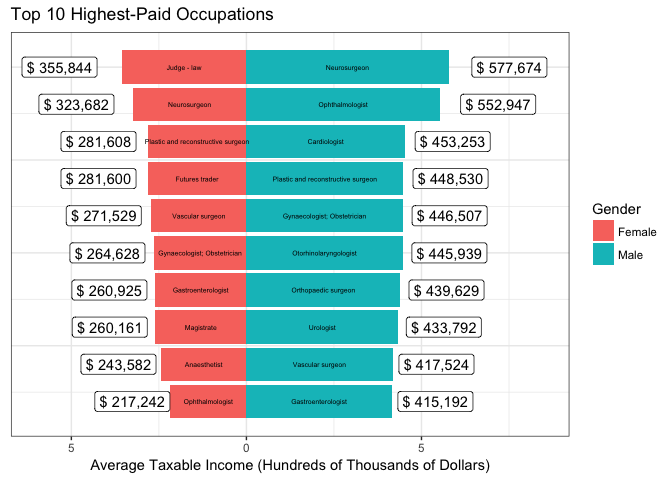

Tidy Tuesday Week 4
================
Felipe Flores

Import Data
===========

``` r
data <- read_csv(file = "week4_australian_salary.csv") %>% 
# The dataset for some reason included some \x96 and \x92 characters that I simply replaced
  mutate(occupation = str_replace(occupation, pattern = "\x96", replacement = "-")) %>% 
  mutate(occupation = str_replace(occupation, pattern = "\x92", replacement = "")) %>% 
# Then I arrange by gender and income
  arrange(gender, desc(average_taxable_income)) %>% 
# And let's only use these variables
  select(c(occupation, gender, average_taxable_income))
```

Tidy up
=======

Here is my approach to getting the first 50

``` r
top_jobs <- data %>% 
  group_by(gender) %>% 
  top_n(50)
```

Female top 50 jobs
------------------

``` r
top_jobs %>% 
  filter(gender == "Female") %>% 
  select(-gender) %>% 
  knitr::kable()
```

| gender | occupation                                                                                                       |  average\_taxable\_income|
|:-------|:-----------------------------------------------------------------------------------------------------------------|-------------------------:|
| Female | Judge - law                                                                                                      |                    355844|
| Female | Neurosurgeon                                                                                                     |                    323682|
| Female | Plastic and reconstructive surgeon                                                                               |                    281608|
| Female | Futures trader                                                                                                   |                    281600|
| Female | Vascular surgeon                                                                                                 |                    271529|
| Female | Gynaecologist; Obstetrician                                                                                      |                    264628|
| Female | Gastroenterologist                                                                                               |                    260925|
| Female | Magistrate                                                                                                       |                    260161|
| Female | Anaesthetist                                                                                                     |                    243582|
| Female | Ophthalmologist                                                                                                  |                    217242|
| Female | Cardiologist                                                                                                     |                    215920|
| Female | Urologist                                                                                                        |                    213094|
| Female | Surgeon - general                                                                                                |                    210796|
| Female | Medical oncologist                                                                                               |                    208612|
| Female | Specialist physicians - other                                                                                    |                    207599|
| Female | Specialist physician - general medicine                                                                          |                    207225|
| Female | Otorhinolaryngologist                                                                                            |                    200136|
| Female | Dermatologist                                                                                                    |                    195030|
| Female | Diagnostic and interventional radiologist                                                                        |                    180695|
| Female | Cardiothoracic surgeon                                                                                           |                    175500|
| Female | Paediatric surgeon                                                                                               |                    175314|
| Female | Endocrinologist                                                                                                  |                    174542|
| Female | Member of parliament                                                                                             |                    173331|
| Female | Rheumatologist                                                                                                   |                    169409|
| Female | Intensive care specialist                                                                                        |                    169369|
| Female | Emergency medicine specialist                                                                                    |                    165786|
| Female | Orthopaedic surgeon                                                                                              |                    159479|
| Female | Neurologist                                                                                                      |                    155217|
| Female | Renal medicine specialist                                                                                        |                    155133|
| Female | Psychiatrist                                                                                                     |                    152437|
| Female | Clinical haematologist                                                                                           |                    147970|
| Female | Paediatrician                                                                                                    |                    147347|
| Female | Securities and finance dealer                                                                                    |                    145208|
| Female | Dental specialist                                                                                                |                    140505|
| Female | Actuary                                                                                                          |                    136819|
| Female | Radiation oncologist                                                                                             |                    135678|
| Female | Financial investment manager                                                                                     |                    134481|
| Female | Petroleum engineer                                                                                               |                    133315|
| Female | Mining production manager                                                                                        |                    133061|
| Female | General medical practitioner                                                                                     |                    129834|
| Female | Thoracic medicine specialist                                                                                     |                    127645|
| Female | Stock exchange dealer; Stockbroker                                                                               |                    124433|
| Female | Paving plant operator                                                                                            |                    123281|
| Female | Mining engineer                                                                                                  |                    119564|
| Female | Tribunal member                                                                                                  |                    119219|
| Female | Doctor - medical practitioner other; Occupational medicine specialist; Public health physician; Sports physician |                    118310|
| Female | Geophysicist                                                                                                     |                    117575|
| Female | Chief executive officer; Executive director; Managing director; Public servant - secretary or deputy secretary   |                    116855|
| Female | Engineering manager                                                                                              |                    116732|
| Female | Metallurgist                                                                                                     |                    110359|

Male top 50 jobs
----------------

``` r
top_jobs %>% 
  filter(gender == "Male") %>% 
  select(-gender) %>% 
  knitr::kable()
```

    ## Adding missing grouping variables: `gender`

| gender | occupation                                                                                                       |  average\_taxable\_income|
|:-------|:-----------------------------------------------------------------------------------------------------------------|-------------------------:|
| Male   | Neurosurgeon                                                                                                     |                    577674|
| Male   | Ophthalmologist                                                                                                  |                    552947|
| Male   | Cardiologist                                                                                                     |                    453253|
| Male   | Plastic and reconstructive surgeon                                                                               |                    448530|
| Male   | Gynaecologist; Obstetrician                                                                                      |                    446507|
| Male   | Otorhinolaryngologist                                                                                            |                    445939|
| Male   | Orthopaedic surgeon                                                                                              |                    439629|
| Male   | Urologist                                                                                                        |                    433792|
| Male   | Vascular surgeon                                                                                                 |                    417524|
| Male   | Gastroenterologist                                                                                               |                    415192|
| Male   | Diagnostic and interventional radiologist                                                                        |                    386003|
| Male   | Dermatologist                                                                                                    |                    383880|
| Male   | Judge - law                                                                                                      |                    381323|
| Male   | Anaesthetist                                                                                                     |                    370492|
| Male   | Cardiothoracic surgeon                                                                                           |                    358043|
| Male   | Surgeon - general                                                                                                |                    357996|
| Male   | Specialist physicians - other                                                                                    |                    344860|
| Male   | Radiation oncologist                                                                                             |                    336994|
| Male   | Medical oncologist                                                                                               |                    322178|
| Male   | Securities and finance dealer                                                                                    |                    320452|
| Male   | Thoracic medicine specialist                                                                                     |                    315444|
| Male   | Specialist physician - general medicine                                                                          |                    315114|
| Male   | Intensive care specialist                                                                                        |                    308033|
| Male   | Renal medicine specialist                                                                                        |                    298681|
| Male   | Neurologist                                                                                                      |                    298543|
| Male   | Financial investment manager                                                                                     |                    288790|
| Male   | Investment broker                                                                                                |                    286530|
| Male   | Paediatric surgeon                                                                                               |                    282508|
| Male   | Clinical haematologist                                                                                           |                    271738|
| Male   | Futures trader                                                                                                   |                    264830|
| Male   | Endocrinologist                                                                                                  |                    258972|
| Male   | Cricketer                                                                                                        |                    257527|
| Male   | Rheumatologist                                                                                                   |                    256933|
| Male   | Dental specialist                                                                                                |                    253442|
| Male   | Magistrate                                                                                                       |                    246737|
| Male   | Equities analyst; Investment dealer                                                                              |                    245826|
| Male   | Paediatrician                                                                                                    |                    239405|
| Male   | Stock exchange dealer; Stockbroker                                                                               |                    238192|
| Male   | Psychiatrist                                                                                                     |                    234557|
| Male   | Emergency medicine specialist                                                                                    |                    232595|
| Male   | Member of parliament                                                                                             |                    232093|
| Male   | Pathologist                                                                                                      |                    224378|
| Male   | Company secretary - corporate governance                                                                         |                    218432|
| Male   | State governor                                                                                                   |                    212652|
| Male   | Actuary                                                                                                          |                    196144|
| Male   | Doctor - medical practitioner other; Occupational medicine specialist; Public health physician; Sports physician |                    187468|
| Male   | Petroleum engineer                                                                                               |                    185808|
| Male   | General medical practitioner                                                                                     |                    184639|
| Male   | Chief executive officer; Executive director; Managing director; Public servant - secretary or deputy secretary   |                    181849|
| Male   | Mining production manager                                                                                        |                    179439|

Graphing
========

``` r
data %>%
  # Scale by hundred thousand dollars
  mutate(income = average_taxable_income/100000) %>%
  # Select the top 10 per gender
  group_by(gender) %>% 
  top_n(10) %>% 
  # Create a rank for the plot
  mutate(rank = rank(income)) %>% 
  # This is so genders are split left and right
  mutate(income = ifelse(test = gender == "Female", yes = -income, no = income)) %>% 
  ggplot(aes(x = rank, y = income, fill = gender, ymin = -6, ymax = 8.5)) +
  geom_col() +
  geom_text(aes(x = rank,y = 0.5*income, label = occupation), size = 1.8) +
  geom_label(
    aes(
      x = rank,
      y = ifelse(test = gender == "Female", 1.5 * income, 1.3 * income),
      label = paste("$", format(100000 * abs(income), big.mark = ","))
    ), 
    fill = "white") +
  ylab("Average Taxable Income (Hundreds of Thousands of Dollars)") +
  labs(title = "Top 10 Highest-Paid Occupations", fill = "Gender") +
  scale_y_continuous(labels = abs) +
  theme_bw() +
  coord_flip() +
  theme(axis.title.y = element_blank(),
        axis.text.y = element_blank(), 
        axis.ticks.y = element_blank()) 
```



``` r
ggsave(filename = "plot1.png", device = "png", plot = last_plot())
```
